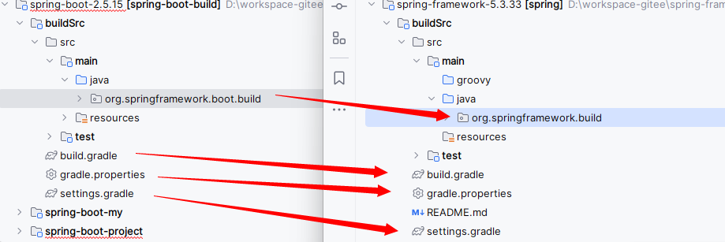

# Spring-all（Spring和Spring Boot源码整合）

这是一个整合了Spring源码和Spring Boot源码的综合项目。相比于独立调试Spring Boot项目【运行到Spring相关的代码时，会进入编译好的只读文件中】在本项目中，当运行到Spring相关代码时，可以直接进入Spring源码，可以轻松地修改代码和添加注释。

## 1. 前言

无论是Spring源码还是Spring Boot源码，如果你直接下载官方的源码包，如果不出意外的话，大概率是要出意外的：你会遇到很多奇奇怪怪的、各种各样的编译问题。在本项目中，很多编译配置都是经过笔者不断尝试、不断试错之后重新修改过的，去掉了很多会导致编译失败的插件或者配置项，把很多坑都填上了，可以让你少走很多编译过程中的弯路，所以：

- 如果你不想被`【BUILD FAILED】`反复折磨，那就请严格按照笔者的教程来准备编译环境。

- 如果你不想被`【BUILD FAILED】`反复折磨，那就请严格按照笔者的教程来准备编译环境。

- 如果你不想被`【BUILD FAILED】`反复折磨，那就请严格按照笔者的教程来准备编译环境。

## 2. 编译步骤

### 2.1 环境准备

本文档提到的`JDK11`和`Gradle 7.5.1`安装包地址：

链接：https://pan.baidu.com/s/1u7B4M5GWSRNszNSoYGllZg?pwd=fx36  提取码：fx36

本文档不会详细介绍某个软件的安装，因为能研究spring源码的你肯定可以自己解决ヽ(￣▽￣)ﾉ

1. `JDK`环境： `JDK 11`  必须的，8和17会有【缺失】【已过时】【待删除】等错误，会编译失败！
2. `gradle`环境：`gradle-7.5.1` spring官方在`gradleWrapper`中指定的版本，注意配置好`GRADLE_HOME`和`GRADLE_USER_HOME`环境变量和`init.d`中的初始化文件，具体操作请自行搜索。

`JDK`就不说了，主要是`gradle`：安装包我已经提供，找个地方解压就算安装了，网上找个教程配一下环境变量，再把我给的`init.gradle`文件放进`init.d`文件夹就行了，其他教程可能会提到让你在项目中的`.gradle`文件也配置一下啥的，这个项目完全不需要，笔者已经将该配置好的东西都配好了，你只需要准备环境就OK了。后续都在`idea`中操作就行了。

### 2.2 开始编译

1. `clone`项目，本项目使用的版本：`springboot 2.5.15` `spring 5.3.33`

2. 用`idea` `open` 本项目，打开后`idea`会自动加载本项目，加载结果我们先不用管，因为我们还需要自己配置一些地方。

3. `idea`中检查项目`SDK`设置和`gradle`设置，具体如图：

【Ctrl+alt+shift+S打开下面的页面】


【Ctrl+alt+S打开下面的页面，再按照左侧目录结构找到`gradle`设置】


4. 关闭前面的设置窗口后，在`idea`最右侧打开`gradle`窗口，右键`build`，设置参数：`build -x test` 表示跳过单元测试。如此成熟的框架，我们完全没有必要去执行单元测试，而且不跳过会`build`失败！


5. 好了，双击`build`，第一次`build`会下载很多依赖文件，耐心等待一下，如果不出意外的话，就能够正常`BUILD SUCCESSFUL`了。


### 2.3 运行代码

现在你可以去`spring-boot-my`模块，编写代码，调试源码了。

```java
package com.example.mingyang;

import org.springframework.boot.SpringApplication;
import org.springframework.boot.autoconfigure.SpringBootApplication;

@SpringBootApplication
public class MyStudyApplication {

	public static void main(String[] args) {
		SpringApplication.run(MyStudyApplication.class, args);
		System.out.println("(♥◠‿◠)ﾉﾞ  启动成功   ლ(´ڡ`ლ)ﾞ  \n");
	}
}
```
## 3. 整合思路
### 3.1 代码结构
如下图，我们先拿一个springboot项目的目录结构举例，大致可以分为三个部分：
1. `buildSrc` gradle默认的插件目录，目录名称是固定写法，可以在其中使用java代码编写逻辑来干预编译流程。
2. `spring-boot-xxx` 源代码
3. `build.gradle settings.gradle ...`gradle的配置文件，类似pom.xml。

### 3.2 整合流程
总体来看，我们需要研究的就是gradle相关的配置，也就是说，我们要分析第一和第三部分的内容，将两个项目对应的配置【融合】成一个。

#### 3.2.1 整合【buildSrc】

两个项目的`buildSrc`结构如图：


1. `src` 目录：插件的源代码，因为两个项目包路径并不同，所以我们可以直接将这一部分合并起来。

   * `spring`项目插件目录为：`org.springframework.build`
   * `springboot`项目插件目录为：`org.springframework.boot.build`
   

2. `build.gradle` 文件：插件的编译配置，内容虽然不一样，但是结构基本相同，都是定义插件、仓库、源代码jdk版本、依赖和【声明插件】，除了声明插件部分，其他都可以直接复制粘贴合并起来。

    ```groovy
    // 定义插件
    plugins {	}
    // 指定仓库地址
    repositories {}
    // 代码jdk版本
    sourceCompatibility = 1.8
    targetCompatibility = 1.8
    // 依赖
    dependencies {}
    // 声明插件
    gradlePlugin {}
    ```

    【声明插件】：我们在`buildSrc`目录编写完插件的java代码后，需要在`build.gradle`文件中声明这个插件，以便后续使用。

    这里做了一些特殊处理，`spring`和`springboot`都定义了一个名为`optionalDependenciesPlugin`的插件：

    ```groovy
    // spring项目
    // optionalDependenciesPlugin 定义插件名称
    optionalDependenciesPlugin {
        // 定义插件的id，后续通过id来引用该插件
        id = "org.springframework.build.optional-dependencies"
        // 定义插件的实现类，对应buildSrc中的src目录下的java类
        implementationClass = "org.springframework.build.optional.OptionalDependenciesPlugin"
    }
    // springboot项目
    optionalDependenciesPlugin {
        id = "org.springframework.boot.optional-dependencies"
        implementationClass = "org.springframework.boot.build.optional.OptionalDependenciesPlugin"
    }
    ```

    很显然，两个插件的名称重复了，如果不处理，后期编译时会报错，所以在本项目中，简单处理了一下，将名称加个后缀即可，因为后续使用是根据id来引用的，名称无所谓。

    ```groovy
    // 这里由于spring和springboot都定义了optional-dependencies插件，并且名字都叫optionalDependenciesPlugin
    // 所以如果只是简单的将spring中的插件复制过来，编译时会报错。需要改一下名字
    optionalDependenciesPlugin1 {
        id = "org.springframework.build.optional-dependencies"
        implementationClass = "org.springframework.build.optional.OptionalDependenciesPlugin"
    }
    optionalDependenciesPlugin2 {
        id = "org.springframework.boot.optional-dependencies"
        implementationClass = "org.springframework.boot.build.optional.OptionalDependenciesPlugin"
    }
    ```

3. 合并`settings.gradle`和`gradle.properties`文件

    * `spring`项目的`settings.gradle`是空的，直接使用`springboot`的即可。

    * `gradle.properties`就是我们常见的配置文件，复制粘贴，重复的去掉即可。

#### 3.2.2 整合【源代码】

两个项目的源代码模块名称没有重复的，直接复制粘贴即可。

#### 3.2.3 整合【配置文件】

1. 整合`build.gradle`：这里的`build.gradle`是父级项目的配置，`spring`和`springboot`项目都在此做了大量的配置，此处不再详细编写文档描写，建议下载源码阅读该文件中的注释。由于`.gradle`文件本质是一个groovy脚本，并不是像pom.xml那样只能简单声明依赖，而是一个可以运行的脚本，因此这个文件中

2. 整合 `setting.gradle`文件，这个文件定义的内容比较简单，大致结构如下，可以很简单的复制粘贴合并起来。

   ```groovy
   // 定义一下仓库和插件
   pluginManagement {
   	repositories {
   		//加上阿里云镜像
   		.....
   	}
   	resolutionStrategy {
   		eachPlugin {
   			....
   		}
   	}
   }
   // 定义当前项目插件
   plugins {
   	id "com.gradle.enterprise" version "3.12.1"
   	id "io.spring.ge.conventions" version "0.0.13"
   }
   // 定义当前项目名称
   rootProject.name="spring-all"
   // 引入本项目的子模块，子模块的子模块也要引入
   include "spring-boot-project:spring-boot-dependencies"
   include "spring-boot-project:spring-boot-parent"
   .....
   // 引入spring相关模块
   include "spring-aop"
   include "spring-beans"
   ....
   include 'spring-boot-my'
   
   // 加载完项目执行如下逻辑
   settings.gradle.projectsLoaded {
   	gradleEnterprise {
   		...
   	}
   }
   ```

#### 3.2.4 建立依赖关系【SpringBoot依赖Spring】

截止到上一步，我们已经将两个项目融合成了一个项目，现在只要通过gradle建立起依赖关系即可。

springboot项目中，原有的引入spring依赖的写法如下：

```groovy
dependencies {
	api("org.springframework:spring-core")
	api("org.springframework:spring-context")
    ....
}
```

这种写法会直接去中央仓库下载依赖，于是改成以下方。

```groovy
dependencies {
    // 表示引入本项目中的spring-core模块
	api(project(":spring-core"))
	api(project(":spring-context"))
    ....
}
```

好了，现在只要使用`idea`的`Ctrl+Shfit+R`全局查找`api("org.springframework:spring-xxx")`，将其替换为`api(project(":spring-xxx"))`就可以了。

## 4.结束语

由于笔者平时都是使用maven来构建项目，对gradle了解比较少，也是为了整合springboot和spring源码才学习的gradle，因此对gradle的了解并不深入，所以本项目中的一些gradle注释可能不是很准确，如果有纰漏，还请不吝赐教。同时，项目源码中存在一些笔者学习时自己添加的注释，也无法保证正确性，笔者也在学习过程中，如果有错误，也欢迎大家指正。此外，关于项目编译或者运行的任何问题都可以提交`ISSUES`，我们可以共同探讨一下。

希望本项目能对你有所帮助！
