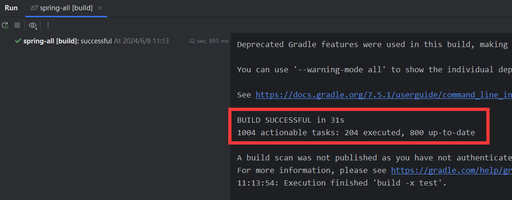

# Spring-all（Spring和Spring Boot源码整合）

这是一个整合了Spring源码和Spring Boot源码的综合项目。相比于独立调试Spring Boot项目【运行到Spring相关的代码时，会进入编译好的只读文件中】在本项目中，当运行到Spring相关代码时，可以直接进入Spring源码，可以轻松地修改代码和添加注释。

## 前言

无论是Spring源码还是Spring Boot源码，如果你直接下载官方的源码包，如果不出意外的话，大概率是要出意外的：你会遇到很多奇奇怪怪的、各种各样的编译问题。在本项目中，很多编译配置都是经过笔者不断尝试、不断试错之后重新修改过的，去掉了很多会导致编译失败的插件或者配置项，把很多坑都填上了，可以让你少走很多编译过程中的弯路，所以：

- 如果你不想被`【BUILD FAILED】`反复折磨，那就请严格按照笔者的教程来准备编译环境。

- 如果你不想被`【BUILD FAILED】`反复折磨，那就请严格按照笔者的教程来准备编译环境。

- 如果你不想被`【BUILD FAILED】`反复折磨，那就请严格按照笔者的教程来准备编译环境。

## 编译步骤

### 环境准备

本文档提到的`JDK11`和`Gradle 7.5.1`安装包地址：

链接：https://pan.baidu.com/s/1u7B4M5GWSRNszNSoYGllZg?pwd=fx36  提取码：fx36

本文档不会详细介绍某个软件的安装，因为能研究spring源码的你肯定可以自己解决ヽ(￣▽￣)ﾉ

1. `JDK`环境： `JDK 11`  必须的，8和17会有【缺失】【已过时】【待删除】等错误，会编译失败！
2. `gradle`环境：`gradle-7.5.1` spring官方在`gradleWrapper`中指定的版本，注意配置好`GRADLE_HOME`和`GRADLE_USER_HOME`环境变量和`init.d`中的初始化文件，具体操作请自行搜索。

`JDK`就不说了，主要是`gradle`：安装包我已经提供，找个地方解压就算安装了，网上找个教程配一下环境变量，再把我给的`init.gradle`文件放进`init.d`文件夹就行了，其他教程可能会提到让你在项目中的`.gradle`文件也配置一下啥的，这个项目完全不需要，笔者已经将该配置好的东西都配好了，你只需要准备环境就OK了。后续都在`idea`中操作就行了。

### 开始编译

1. `clone`项目，本项目使用的版本：`springboot 2.5.15` `spring 5.3.33`

2. 用`idea` `open` 本项目，打开后`idea`会自动加载本项目，加载结果我们先不用管，因为我们还需要自己配置一些地方。

3. `idea`中检查项目`SDK`设置和`gradle`设置，具体如图：

【Ctrl+alt+shift+S打开下面的页面】


【Ctrl+alt+S打开下面的页面，再按照左侧目录结构找到`gradle`设置】


4. 关闭前面的设置窗口后，在`idea`最右侧打开`gradle`窗口，右键`build`，设置参数：`build -x test` 表示跳过单元测试。如此成熟的框架，我们完全没有必要去执行单元测试，而且不跳过会`build`失败！


5. 好了，双击`build`，第一次`build`会下载很多依赖文件，耐心等待一下，如果不出意外的话，就能够正常`BUILD SUCCESSFUL`了。




6. 现在你可以去`spring-boot-my`模块，编写代码，调试源码了。
```java
package com.example.mingyang;

import org.springframework.boot.SpringApplication;
import org.springframework.boot.autoconfigure.SpringBootApplication;

@SpringBootApplication
public class MyStudyApplication {

	public static void main(String[] args) {
		SpringApplication.run(MyStudyApplication.class, args);
		System.out.println("(♥◠‿◠)ﾉﾞ  启动成功   ლ(´ڡ`ლ)ﾞ  \n");
	}
}
```
## 整合思路

todo
